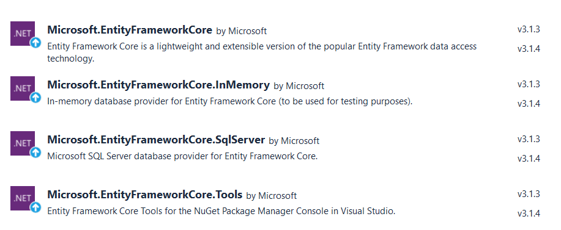

# TodoApp
Az alkalmazás egyszerű CRUD műveletek végrehajtását szemlélteti EF Core-t használva In Memory és SqlServer provider-ekkel. 

Az egyes példák ```Example1```, ```Example2```,... függvényekben vannak, a megfelelőt kikommentezve és futtatva nézzük meg ezeket. Mindezek előtt adjuk a project-hez az EF-et!

## EF setup
Először is hozzá kell adnunk a project-hez a megfelelő EF NuGet package-eket.
A példákhoz használt provider-eket is hozzáadva a következőket kell látnunk, hogy telepítve vannak:



- Microsoft.EntityFrameworkCore az alap package EF-hez.
- Microsoft.EntityFrameworkCore.InMemory a memóriában létező "adatbázis" használatához, a példák egyrészében ezt használom szemléltetéshez, egyébként ez hasznos és használt provider teszteléshez.
- Microsoft.EntityFrameworkCore.SqlServer MSSQL szerver használatához.
- Microsoft.EntityFrameworkCore.Tools EF command-ok használatáshoz, hogy a használt code-first megközelítésnél migrálás és DB frissítési parancsokat lehessen kiadni.

Következő lépés a megfelelő package-ek hozzáadása után a model osztályok és a ```DbContext``` osztályunk létrehozása.

Model osztályokat a Model mappába (és ezzel model namespace-be) kerültek: tárolunk tantárgyakat (```Subject```) és hozzájuk tartozó teendőket (```TodoItem```).

Egyfajta konvenció, hogy az egy-több és több-több kapcsolatoknál ```ICollection<T>```-t használunk. Másik konvenció, hogy az ```Id``` nevű property-kből generálódnak az elsődleges kulcsok az adatbázisban, viszont ha nincs ilyen nevű property-nk, akkor a ```[Key]``` attribútum is használható vagy leírhatjuk a ```DbContext```-ben is a speciális leképzési igényeinket.

(Ezen kívül felül lettek definiálva a ```ToString``` metódusok későbbi kiíratás/ellenőrzés céljából.)

Nézzük a ```DbContext```-et! Ez a Data mappában/namespace-ben van. Ahhoz, hogy használjuk az EF-et le kell származtatnunk egy saját osztályt a ```DbContext``` ősosztályból. Ebben az osztálybanmeg kell adnunk, hogy melyek a model osztályaink és létre kell hoznunk ezeknek egy-egy ```DbSet```-et. A korábban említett speciális leképzési szabályainkat az ```OnModelCreating``` felüldefiniálásával tehetjük meg.

Ezeken kívül a konstruktor került módosításra: egy plusz beállításokat tartalmazó ```DbContextOptions``` objektumot várunk paraméterként. Ebben fogjuk a későbbiekben megadni, hogy például InMemoryDB-t vagy SqlServer-t akarunk használni.

A Data namespace-be van még egy ```DbService``` nevű osztály is. Ebben vannak definiálva a kliens számára elérhető, publikus műveletek, mint például tantárgyak és teendők létrehozása, módosítása, törlése, lekérdezése. Megjegyzendő, hogy nem itt hozzuk létre a ```DbContext```-et, itt csak megkapjuk azt a konstruktorban! Annak létrehozása és konfogurálása a hívó oldalán történik!

## Example1
Most, hogy megvagyunk az előkészületekkel nézzük, hogy hogyan működik az EF.

Először is konfiguráljuk a ```DbContext```-et ```DbContextOptionsBuilder```-rel: megmondjuk, hogy InMemoryDb-t akarunk használni  "TodoDB" névvel.
Ezután létrehozunk egy ennek megfelelő ```DbContext```-et, majd a ```DbService```-nek átadjuk ezt. Mostmár van egy ténylegesen használható ```DbService```-ünk!

A ```DbService``` ```AddSubject``` metódusában létrehozunkegy új ```Subject```-et a megadott névvel, hozzáadjuk a DB-ben lévő ```Subject```-ekhez, majd elmentjük.

Megjegyzendő, hogy a ```DbContext```-ben létrehozott ```DbSet```-hez adjuk hozzá az új ```Subject```-et és ekkor még nem történt adatbázisba való írás/mentés. Ahhoz hogy mentésre kerüljenek a módosítások szükséges egy ```SaveChanges``` hívás is!

```AddTodo``` metódussal a teendőt hasonló módon adjuk hozzá. Eltérés az, hogy itt először lekérjük azt a tantárgyat, amihez a teendő tartozik. Megjegyzendő, hogy lazy loading elkerülése miatt használatos az ```Include```! Ekkor az adott objektumhoz tartozó lista is betöltésre kerül.

Lazy loading esetében ez a lista null lesz és hibát kapunk futási időben.

Akkor is hibát kapunk, ha "elgépeljük" a tantárgy nevét, mert ekkor a FirstOrDefault default értéket azaz null-t ad a lekért tantárgynak értékül.

Lekérésnél láthatjuk, hogy a hozzáadások és a rekordok közötti kapcsolatlétrehozás sikeres volt.

## Example2
Hozzáadni új rekordokat nemcsak az alapján tudunk, hogy egy property-t (jelen esetben név) ismerünk. Ajánlott Id-kkel dolgozni, hiszen ezek feladata az egyes rekordok egyedi azonosítása.

Második példa ugyanazt a szenáriót szemlélteti, mint az első, kivéve, hogy itt nem tantárgy neve alapján hanem annak Id-ja alapján adunk hozzá új teendőt.

## Example3
Harmadik példa szemlélteti, hogy nincs semmi "biztos csak azért működik, mert első elem..." mágia a hozzáadások mögött, több tantárggyal és több teendővel is minden az elvárt műdon működik.

Ezen kívül egy feltételes lekérés is van. Láthatjuk, hogy egy adott lekérdezést többféleképpen is megfogalmazhatunk Linq és navigációs property-k segítségével.

A használt ```Where(t=>t.Subject == subject)``` szintaxis egy lambda kifejezés. Ezt ajánlott használni a query-knél.

## Example4
Negyedik példa egy módosítás műveletet szemléltet.

Vegyük észre, hogy először elkérjük a módosítandó objektumot property-k alapján (ezt megtehetnénk Id-kkal is akár), majd ezt az objektumot módosítjuk és mentjük az adatbázist.

## Example5
Ötödik példa ugyanaz, mint az előző, leszámítva a kérés paraméterezését. Ezt is megtehetjük, hogy egy adott függvényt többféleképpen paraméterezünk (polimorfizmus).

## Example6
Hatodik példa törlést szemléltet. Módosításhoz hasonlóan először megkeressük az adott rekordot, majd hozzáadáshot hasonlóan a megfelelő ```DbSet```-ből eltávolítjuk azt és persze mentés.

Megjegyzendő, hogy kiíratásnál először az adott tárgy teendőit majd az összes tárgy teendői kerültek kiíratásra, tehát a teendő ténylegesen eltávolításra került és nem csak a tantárgy teendői közül.

## Example7
Hasonlóan a hatodikhoz a következő példa is törlést szemléltet, azonban most olyan elemet, amihez van egy-több kapcsolat "egy" oldalán álló elem.

Miért nem működik a jelenlegi kód? Miért kapunk hibát ha megpróbáljuk futtatni?

## Example8
Ugyanaz a törlés, mint az előbb csak most működőképesen azaz kaszkádosított törléssel.

Kaszkádosított törlésnél az olyan rekordok, amelyek hivatkoznak a törlésre kerülendő rekordhoz (mint mondjuk most ha törölni akarjuk a "Random GTK-s tárgyat", akkor az magával vonza azt is, hogy töröljük a hozzá tartozó "ZH1" és "ZH2" teendőket.)

Ez jelenleg "kézileg" van megoldva, tehát lekérjük a kapcsolódó teendőket, először azokat távolítjuk el, majd az egész tantárgyat. Ahhoz, hogy ez automatikusan működjön kézi beavatkozás nélkül az ```OnModelCreating```-ben egy ```OnDelete```-et is be kell állítanunk az egyes Entity-kre (ez most nincs benne a kódban).

## Example9
Ennél a példánál nem az eddig hasnzált InMemoryDB-t, hanem egy tényleges adatbázist fogunk használni.

Ehhez először a ```DbContextOptionsBuilder```-rel meg kell mondanunk, hogy SqlServer-t akarunk használni a megadott connection string-gel. Ez most a localdb-nkben lévő "TodoDB" lesz.

Ha futtatjuk a demót a 9.példával hibát fogunk kapni az első mentésnél.

Ez azért van, mert nincs létrehozva az adatbázisunk de mégis használni szeretnénk.

Azért, hogy legyen a Package Manager Console-on adjuk ki a követekző parancsokat:

```Add-Migration InitialMigration```

```Update-Database```

Az első parancs sikeres lefutásához szükségünk lehet egy plusz osztályra, egy ```DesignTimeDbContextFactory```-ra. Ez is a Data mappában/namespace-ben van.

Az első parancs sikeres lefutása után láthatjuk, hogy egy új Migrations mappa/namespace létrejött. Ebben vannak a model alapján generált szükséges utasítások, parancsok ahhoz, hogy az adatbázis létre tudjon jönni.

A második parancs az előzőekben létrehozott kódot lefuttatja és így létrejön az adatbázisunk, ami mostmár az SQL Server Object Explorer-ben a localdb alatt meg is jelenik.

A példa ugyanazt a szenáriót mutatja be, amit a legutóbbi feladat (+cleanup). Miután lefutott a program, láttuk az eredményt, nézzük meg,hogy mi van az adattáblákban. Használjuk az SQL Server Object Explorer-t! Ahogy láthatjuk a tantárgyunk ott van és a hozzá tartozó teendők is. Érdemes megnézni, hogy a ```Subject```-ben definiált ```ICollection```-nek látszólag semmi nyoma, míg a ```TodoItem```-ek kaptak egy plusz oszlopot ```SubjectId``` néven, amellyel ez az egy-több leképzés ténylgesen meg van oldva.

Megjegyzendő hogy ha az utolsó cleanup kérést is a kódban hagyjuk, akkor ugyan "üres" lesz az adatbázisunk olyan értelemben, hogy nincs benne egy rekord se, de későbbi futásnál láthatjuk, hogy ez nem inicializálja minden alkalommal újra az adatbázist, hanem az "előzőleg létrehozottat" használja és így például az Id értékek automatikusan nőnek.
