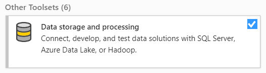
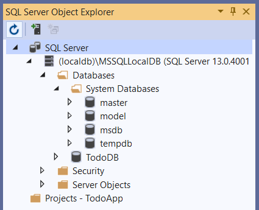
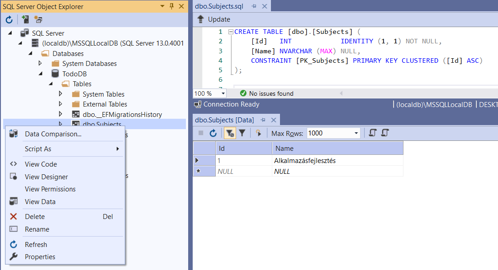

# Entity Framework bevezető
.NET környezetben adatkezeléshez és ORM-hez az Entity Framework-öt használjuk. (Ennek van .NET Framework-ös verziója: az Entity Framework és van .NET Core-os veziója: az Entity Framework Core. Ezek kisebb-nagyobb funkcionalitásban, részletekben eltérőek, de alapjában véve ugyanazt a feladatot végzik.)

Entity Framework NuGet package formátumban adható hozzá a project-hez. 

## ORM
Az objektum-relációs leképezésnél a kódban használt C# (vagy más programozási nyelv) osztályait adatbázis táblákra képezzük le. Adatbázisban adatokat tárolunk, nem függvényeket, metódusokat vagy funkcionalitást.

Alap ORM konvenciók:
1. Egy model osztálynak egy adatbázis tábla felel meg
2. A model osztály egy attribútumának/property-jének/field-jének az adatbázis táblájának egy oszlopa felel meg
3. Egy model osztály konkrét példányának az adatbázis táblájának egy rekordja felel meg

Az ORM leképzés természetesen nem mindig ilyen egyszerű. Gondoljunk olyan esetekre, amikor az adattáblák között kapcsolat van (egy-egy, egy-több, több-több). 

## Adatbázis provider-ek

Az EF különböző típusú adatbázisokkal képes kapcsolatot felépíteni és query-ket végrehajtani rajtuk, ehhez különböző úgynevezett provider-eket használhatunk. Egy provider egy adott típusú adatbázissal való kommunikációt implementál, például az SqlServer provider MSSQL szerverhez, a MySQL provider MySQL szerverhez való kapcsolódást biztosít.

Ez főleg azért hasznos, mert kevés kód és konfiguráció módosítással ugyanazt a már megírt kódot fel tudjuk használni ha az adatbázis réteget le szeretnénk cserélni.

Az egyes provider-ek implementációjukban részleteikben eltérőek lehetnek. Az is előfordulhat, hogy valamilyen típusú adatbázishoz nincs provider.

További részletek ezen a linken: https://docs.microsoft.com/en-us/ef/core/providers

A különböző provider-ek használatához a megfelelő NuGet package-eket kell hozzáadnunk a project-hez.

## Code-first, DB-first, Model-first megközelítés
Három opciónk van EF-fel való kezdésnél: Code-first, DB-first és Model-first megközelítés.

EF segítségével konkrét adatbázis kezelő alkalmazás nélkül is létre tudunk hozni és használni adatbázisokat úgy, hogy az egyes model osztályokat megfelelően konfiguráljuk C# kódban, majd migráció segítségével ezeket ténylegesen érvénybe léptetjük és ezután tipikusan Linq segítségével query-ket írunk (Code-first). 

Persze, ha ragasznodunk ahhoz, hogy sajátkezűleg hozzuk létre az adatbázist táblákkal együtt, akkor az is megoldható, hogy az EF ebből generáljon úgynevezett Entity Data Model-t és C# model osztályokat (DB-first).

Egy ritkábban használt megoldás, hogy ezt az Entity Data Model-t hozzuk létre szerkesztőfelületen majd ebből generáltatunk adatbázist és model osztályokat is (Model-first).

## Connection string
Ahhoz, hogy egy adatbázishoz kapcsolódni tudjunk szükségünk van a kapcsolatfelépítéshez bizonyos adatokra, információkra. Ilyen például, hogy hol található az adatbázis, autentikácihoz felhasználónév és jelszó, biztonsági beállítások. (MSSQL szerverhez a connection string-et otthoni/fejlesztési fázisban általában localdb-vel konfigurálunk.)

További információ ezen a linken https://docs.microsoft.com/en-us/ef/core/miscellaneous/connection-strings

## localdb és SQL Server Object Explorer
Gyakran használható adatbázis SqlServer provider-rel a localdb. Ahhoz, hogy ezt használni tudjuk illetve Visual Studio-ban meg tudjuk nézni az egyes adatbázis műveletek eredményét Visual Studio Installer-ben a ```Data storage and processing``` elemet telepítenünk kell

Visual Studio-n belül View -> SQL Server Object Explorer-t választva az alábbi nézetet tudjuk előhozni:



Itt láthatjuk, hogy jelenleg milyen adatbázisokat tudunk elérni. A (localdb)\MSSQLLocalDB alatt láthatjuk az Installer által telepített localdb-nket. Vannak rendszer adatbázisok és olyanok, amiket mi hoztunk létre, a képen ilyen a TodoDB, amelyről a következő részben lesz szó.



Nézzük meg, hogy milyen dolgokat tudunk meg a TodoDB-ről az SQL Server Object Explorer segítségével!



Megtudhatjuk, hogy az egyes táblák milyen konkrét SQL query-vel lettek létrehozva, ehhez válasszuk a View Code opciót az adott táblán jobb klikk után.

Megtudhatjuk, hogy jelenleg milyen rekordok vannak az alábbi táblában, ehhez válasszul a View Data opciót. Megjegyzendő, hogy ez nem az összes rekordot adja vissza, hiszen elképzelhető, hogy több száz vagy ezer rekordunk van, ez csak az első x rekordot adja vissza, Max Rows-al szabályozhatjuk, hogy mennyi legyen ez az x.


A következő részben nézzünk egy pár példát EF használatára!
